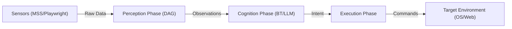

# Dataflow Architecture: Observation to Command

This document details the standardized pipeline for data processing within the Serpentine Engine, as defined in the [Consolidation Strategy](../planning/consolidation_strategy.md).

## 1. Pipeline Overview

The engine follows a linear data transformation path, ensuring that logic components (Mind) are decoupled from physical components (Sensors/Actions).

## 2. Data Structures

### A. Observations (The Perception Output)
Standardized Pydantic models emitted by the `PerceptionPipelineSystem`.
- **Fields**: `timestamp`, `source_id`, `entities` (detected boxes), `structured_data` (DOM/OCR).
- **Consolidation Benefit**: Mind nodes can query `ObservationComponent` without knowing if the data came from a Screenshot or a browser's DOM.

### B. Intent (The Mind Output)
Logical goals produced by Behavior Tree leaf nodes.
- **Example**: `MoveToEntityIntent(target_id="enemy_1")`.
- **Consolidation Benefit**: Intent is non-physical. It describes *what* the agent wants, not *how* to do it.

### C. Commands (The Execution Input)
Physical instructions for the environment.
- **Example**: `ClickCommand(x=100, y=200)` or `KeyTypeCommand(text="Hello")`.
- **Consolidation Benefit**: Actions become cross-platform. A `ClickIntent` can be mapped to a `PyAutoGUI.click` in OS mode or a `Playwright.click` in Web mode.

## 3. Propagation via Event Bus

To maintain high decoupling, major data transitions are broadcasted via the **Unified Event Bus**:
- `ON_OBSERVATION_EMITTED`: Triggered after Perception.
- `ON_INTENT_FORMED`: Triggered after Cognition.
- `ON_COMMAND_EXECUTED`: Triggered after Execution for telemetry.

## 4. Integration with Registry V2

The flow is orchestrated by the **Registry V2**. Systems find their required data pools by querying the Registry for components that satisfy the "Observation" or "Intent" traits.
