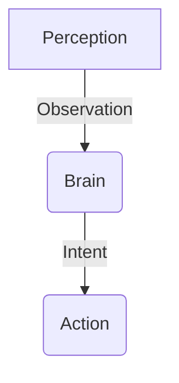

# Documentation Guide: Developing for Users & Developers

This guide establishes the standards for documenting the Serpentine Engine. It ensures that as the framework grows, both end-users (who build agents) and core developers (who extend the engine) have clear, actionable information.

## 1. Documentation Philosophy

We follow the **Diátaxis Framework**, dividing documentation into four distinct types:

1.  **Tutorials**: "Take me by the hand" learning (e.g., *Build your first Snake Agent*).
2.  **How-To Guides**: "I have a specific problem" (e.g., *How to add a new Component*).
3.  **Reference**: Technical descriptions (e.g., *API Reference for `World` class*).
4.  **Explanation**: High-level concepts (e.g., *Understanding the ECS Loop*).

---

## 2. Documenting for the End User (Agent Builder)

The End User is a developer using Serpentine to build bots/agents. They care about *using* existing Systems and Nodes.

### 2.1. The "How-To" Pattern
When creating a new feature (e.g., a new Perception Node), add a section to `des_docs/guides/modes/` or a dedicated `guides/` file.

**Structure:**
*   **Goal**: What will the user achieve?
*   **Prerequisites**: What components/imports are needed?
*   **Step-by-Step**: Code snippets showing usage.
*   **Common Pitfalls**: What usually goes wrong?

### 2.2. Docstrings for Nodes
Every Behavior Tree Node or Perception Node **must** have a docstring that answers:
1.  **Inputs**: What `Blackboard` keys does it read?
2.  **Outputs**: What keys does it write?
3.  **Parameters**: What are the Pydantic config fields?

```python
class FindImageNode(PerceptionNode):
    """
    Scans the screen for a template image.

    Inputs:
        - perception.screen (np.ndarray): The current frame.

    Outputs:
        - target_loc (Tuple[int, int]): Coordinates of the match.

    Params:
        - threshold (float): Confidence level (0.0 - 1.0).
    """
```

---

## 3. Documenting for the Core Developer (Engine Extender)

The Core Developer modifies the engine internals (e.g., adding a new Renderer or Physics engine).

### 3.1. Architectural Decision Records (ADR)
Major changes (like switching from PyGame to ModernGL) must be documented in `des_docs/architecture/` before implementation.

**Template:**
*   **Context**: Why are we doing this?
*   **Decision**: What is the new approach?
*   **Consequences**: What breaks? What improves?

### 3.2. System Implementation Guide
Refer to `des_docs/guides/system_implementation_guide.md` for standard patterns.

**Key Rule**: If you add a new `@register_system` decorator param, update the guide immediately.

---

## 4. Documentation Workflow

### 4.1. When to Document?
*   **Before Code**: Update `des_docs/planning/tasks.md` and create a rough design in `des_docs/architecture/`.
*   **During Code**: Write docstrings and type hints.
*   **After Code**: Update the relevant `des_docs/guides/phases/` file to reflect the new state.

### 4.2. File Location Strategy
*   **High-Level**: `des_docs/architecture/`
*   **User Guides**: `des_docs/guides/`
*   **API Specs**: `des_docs/api_ml/` or `des_docs/architecture/COMPONENT_REFERENCE.md`

### 4.3. Keeping it Sync
Run `grep` searches for the component name in `des_docs/` to find outdated references when renaming or refactoring.

---

## 5. Visual Documentation
Complex interactions (like the Tick Loop or Message Routing) require diagrams.

*   **Tools**: Use **Mermaid.js** inside Markdown files.
*   **Location**: Embed directly in `architecture/` files.



## 6. Documenting Technical Debt & Stubs

In the rare case where temporary code is necessary (e.g., a mock waiting for an external API), you **must** document it.

### 6.1. The "Why" and "When"
A stub without explanation is a bug. Your docstring must explain:
1.  **Limitation**: What is missing?
2.  **Reason**: Why is it missing now? (e.g., "Waiting on Issue #42")
3.  **Impact**: What happens if the user calls this?

### 6.2. Example: Explicit Stub
```python
def fetch_user_data(user_id: str) -> dict:
    """
    [TEMPORARY] Returns mock data for offline development.

    TODO(jules): Connect to UserAPI (Issue #101) once VPN is stable.

    Returns:
        dict: Hardcoded user profile.
    """
    # Explicit warning log is mandatory for runtime awareness
    logger.warning("Using MOCK fetch_user_data - do not use in production!")
    return {"name": "Test User", "role": "admin"}
```
